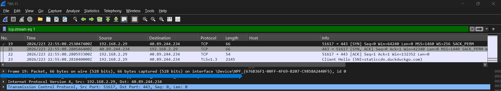

# Enterprise Network Operations Lab

Hands-on network troubleshooting and packet-analysis portfolio project demonstrating how I approach connectivity issues from initial triage through investigation, validation, escalation, and documentation.

## Project Highlights

* Performed live packet capture and analysis with Wireshark
* Validated local gateway connectivity using ICMP
* Analyzed DNS query and response traffic
* Identified a successful TCP three-way handshake to an HTTPS service
* Created a structured network troubleshooting runbook
* Documented a simulated branch-to-corporate connectivity incident
* Designed a fictional enterprise topology covering LAN, DMZ, firewall, VPN, and routing concepts

## Hands-On Packet Analysis

I generated and captured network traffic from a Windows endpoint, then used Wireshark to isolate and analyze ICMP, DNS, and TCP traffic.

### ICMP Connectivity

Confirmed successful communication between the endpoint and its default gateway using ICMP Echo Request and Echo Reply traffic.

### DNS Resolution

Captured an A-record query for `google.com` and verified a successful DNS response containing multiple IPv4 addresses.

### TCP Connection Establishment

Isolated a TCP conversation and identified the complete three-way handshake:

`SYN → SYN-ACK → ACK`

The handshake was followed by a TLS 1.3 Client Hello, confirming that the TCP connection was established before encrypted application traffic began.

➡️ [View the full Wireshark Packet Analysis](analysis/wireshark-packet-analysis.md)



## Troubleshooting Approach

The project follows a progressive troubleshooting workflow:

1. Confirm the scope of the issue
2. Validate endpoint IP configuration
3. Test local connectivity
4. Test the default gateway
5. Validate DNS resolution
6. Review the network path and routing
7. Consider VPN, firewall, and NAT behaviour
8. Use packet capture when additional visibility is required
9. Document findings and escalate with evidence when necessary

➡️ [View the Network Connectivity Troubleshooting Runbook](documentation/network-troubleshooting-runbook.md)

## Simulated Enterprise Scenario

A fictional enterprise environment is used to demonstrate how the same troubleshooting process can be applied to a branch-to-corporate connectivity issue.

The environment includes:

* Corporate LAN: `10.10.10.0/24`
* Branch LAN: `10.20.20.0/24`
* DMZ: `10.30.30.0/24`
* Remote-access VPN pool: `10.40.40.0/24`
* Corporate firewall
* Corporate and branch routing
* Simulated site-to-site VPN connectivity

➡️ [View the Enterprise Network Topology](diagrams/network-topology.md)

➡️ [View the Branch-to-Corporate Connectivity Incident](troubleshooting/branch-connectivity-incident.md)

## Skills Demonstrated

### Hands-On

* Wireshark packet analysis
* ICMP troubleshooting
* DNS analysis
* TCP connection analysis
* Windows network troubleshooting
* Connectivity validation
* Packet filtering
* Technical documentation

### Applied Through the Simulated Scenario

* TCP/IP troubleshooting methodology
* LAN and WAN concepts
* Routing analysis
* VPN troubleshooting concepts
* Firewall policy analysis
* NAT troubleshooting concepts
* Incident triage
* Escalation
* Root-cause analysis
* Runbook development

## Tools and Commands

**Tools**

* Wireshark
* Windows Command Prompt / PowerShell

**Commands**

```text
ipconfig /all
ping
tracert
nslookup
route print
arp -a
```

**Wireshark filters**

```text
icmp
dns
tcp.flags.syn == 1
tcp.stream eq 1
```

## Project Structure

```text
enterprise-network-operations-lab/
├── README.md
├── analysis/
│   └── wireshark-packet-analysis.md
├── diagrams/
│   └── network-topology.md
├── documentation/
│   └── network-troubleshooting-runbook.md
├── screenshots/
│   ├── icmp-connectivity-test.png
│   ├── dns-query-response.png
│   └── tcp-three-way-handshake.png
└── troubleshooting/
    └── branch-connectivity-incident.md
```

## Privacy

This is an independent portfolio project.

The enterprise topology, IP ranges, names, and troubleshooting scenario are fictional. They do not represent an employer, customer, or production environment.

The Wireshark analysis was performed on a personal network. Unnecessary hardware identifiers were obscured before publication, and the complete packet capture is retained locally rather than published in this repository.
