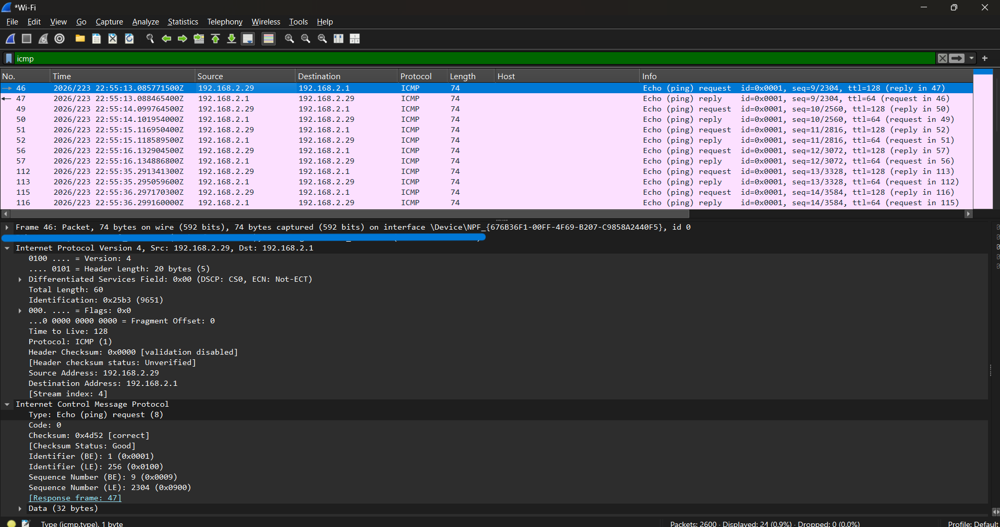
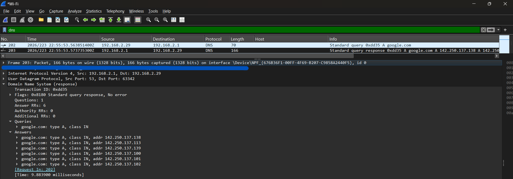

# Wireshark Packet Analysis

## Overview

This exercise demonstrates basic network troubleshooting and packet-analysis techniques using Wireshark.

Traffic was generated from a Windows endpoint and analyzed to validate three areas of network connectivity:

1. Local gateway connectivity using ICMP
2. DNS name resolution
3. TCP connection establishment

The full packet capture is retained locally and is not published in this repository. Screenshots are included to document the analysis while limiting exposure of unnecessary network metadata.

---

## 1. ICMP Connectivity Test

A ping test was performed between the Windows endpoint and the local default gateway.

- Client: `192.168.2.29`
- Default gateway: `192.168.2.1`
- Protocol: ICMP

The capture shows ICMP Echo Request packets sent from the client to the default gateway and corresponding Echo Reply packets returned by the gateway.

### Result

Successful ICMP request-and-reply traffic confirms IP connectivity between the endpoint and the local default gateway during the test.



---

## 2. DNS Resolution Analysis

A DNS lookup for `google.com` was captured and analyzed.

The client sent an A-record query to the local DNS server. The server returned a successful response containing multiple IPv4 addresses.

The DNS response reported `No error`.

### Result

The successful query and response demonstrate that DNS name resolution was functioning correctly during the test.



---

## 3. TCP Connection Establishment

A TCP connection to a remote HTTPS service was isolated using Wireshark's TCP conversation filtering.

The capture shows the TCP three-way handshake:

1. Client sends `SYN`
2. Remote server responds with `SYN, ACK`
3. Client responds with `ACK`

The destination service uses TCP port `443`.

Following completion of the TCP handshake, the capture shows a TLS 1.3 Client Hello, indicating that encrypted application-layer communication began after the transport connection was established.

### Result

The SYN, SYN-ACK, and ACK sequence confirms successful TCP connection establishment between the client and the remote service.


---

## Troubleshooting Interpretation

These tests demonstrate a progressive approach to connectivity troubleshooting.

### Local Connectivity

ICMP traffic was used to verify communication between the endpoint and its default gateway.

### Name Resolution

DNS traffic was examined separately to confirm that hostname resolution was functioning.

### Transport Connectivity

TCP traffic was analyzed to confirm that a connection to a remote service successfully completed the three-way handshake.

Separating these tests helps determine whether a connectivity problem is associated with the local network, DNS resolution, or transport-layer communication.

## Wireshark Filters Used

```text
icmp
dns
tcp.flags.syn == 1
tcp.stream eq 1
```

## Privacy

This exercise was performed on a personal network. Device MAC addresses and other unnecessary hardware identifiers were obscured from screenshots before publication.

The complete packet capture is retained locally and is not included in this public repository.
