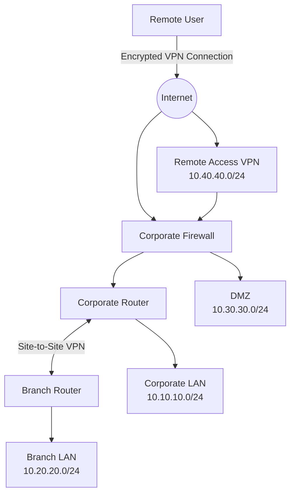

# Enterprise Network Topology

## Overview

This fictional network represents a small enterprise environment with a corporate location, branch office, DMZ, site-to-site VPN, remote-access VPN, and internet connectivity.

The topology is used throughout this project to demonstrate network troubleshooting, routing, firewall, VPN, DNS, DHCP, NAT, and packet-analysis concepts.

## Logical Topology

## Network Segments

| Segment | Address Range | Purpose |
|---|---|---|
| Corporate LAN | `10.10.10.0/24` | Corporate users and internal services |
| Branch LAN | `10.20.20.0/24` | Simulated branch-office users |
| DMZ | `10.30.30.0/24` | Public-facing or isolated services |
| Remote Access VPN | `10.40.40.0/24` | Address pool for remote VPN users |

## Key Network Components

### Corporate Firewall

Provides simulated:

- Traffic filtering
- Network segmentation
- NAT
- VPN connectivity
- Access-control enforcement

### Corporate Router

Provides connectivity between the corporate network and other network segments.

### Branch Router

Provides connectivity between the branch LAN and corporate environment through the simulated site-to-site VPN.

### Site-to-Site VPN

Provides an encrypted connection between:

`10.20.20.0/24`

and

`10.10.10.0/24`

### Remote Access VPN

Provides simulated secure remote connectivity for users accessing internal corporate resources.

## Services Used in the Lab

The lab exercises may involve:

- TCP/IP
- DNS
- DHCP
- ICMP
- Routing
- NAT
- Firewall policy
- Site-to-site VPN
- Remote-access VPN
- Wireshark packet analysis

## Important Note

This topology is fictional and was created specifically for this portfolio project. IP addresses, network names, systems, and scenarios do not represent any employer, customer, or production environment.
